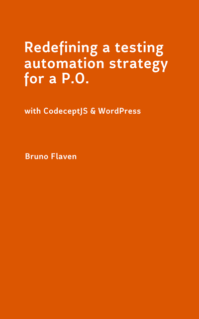

# Book #3 Redefining a testing automation strategy for a P.O with CodeceptJS & WordPress

**Below you can find information and code about this book for sale on Amazon: [https://www.amazon.com/dp/B0865TT96K/](https://www.amazon.com/dp/B0865TT96K/)**



### Foreword
It all started with a double injunction: on the one hand holding a training course in Zambia on behalf of the ZNBC and on the other hand my designation as P.O on a backoffice.


1. The Book #1 retrieves all the materials that I have brought with me for a training in Zambia on how to manage and run a news website. I made as intuitive and operational as possible. For a P.O, it is transcription of a “know-how” patiently gathered about digital project management with Agile Scrum. It has been transposed mostly to WordPress so anyone can leverage on it. It retains a maximum of good practices under usual constraints like budget, technics and team.


2. My experience in P.O forced me to take a strong interest in testing. The idea was to overcome with "agility" and in a practical way, one of the most difficult obstacles for a webapplication (backoffice, website): user acceptance testing. In comparison to this testing issue, the design and evolution of a web application seems almost easier! Indeed, how to minimize the risk of this acceptance phase, to limit this phase in time and its "toxicity" for P.O in order to avoid regressions or side effects. In short, that each GO does not turn into a nightmare! Even though it is a collective responsibility for a team, What is a P.O worth if he/she is unable to ensure that ist product quality is acceptable? With a P.O (Product Owner) mindset, Book #2 & Book #3 tries concretely to answer to these questions with the help of CP (Codeception) and CPJS (CodeceptJS).


## The continuous learning trilogy

### Book #1
**The good and small "Zambian" guide for WordPress. How to run a News Website with WordPress?**

- Github: [https://github.com/bflaven/book-small-guide-zambia-wordpress-running-news-website](https://github.com/bflaven/book-small-guide-zambia-wordpress-running-news-website)
- Amazon: [https://www.amazon.com/dp/B08645F8DZ/](https://www.amazon.com/dp/B08645F8DZ/)

### Book #2
**Defining a testing automation strategy for a P.O. with CODECEPTION_ & WordPress**
- Github: [https://github.com/bflaven/book-defining-testing-strategy-agile-po-codeception](https://github.com/bflaven/book-defining-testing-strategy-agile-po-codeception)
- Amazon: [https://www.amazon.com/dp/B0864VS2Y6/](https://www.amazon.com/dp/B0864VS2Y6/)

### Book #3
**Redefining a testing automation strategy for a P.O. with CodeceptJS & WordPress**
- Github: [https://github.com/bflaven/book-redefining-testing-strategy-agile-po-codeceptjs](https://github.com/bflaven/book-redefining-testing-strategy-agile-po-codeceptjs)
- Amazon: [https://www.amazon.com/dp/B0865TT96K/](https://www.amazon.com/dp/B0865TT96K/)


### Acknowledgments

For book #2 & book #3, after a quick benchmark of the market solutions and the constraints that were mine, I totally relied on Codeception and CodeceptJS. I would like to take this opportunity to warmly thank the the Codeception (CP) and CodeceptJS (CPJS) team's excellent work and the remarkable documentation that accompanies it. Without this documentation, I believe that I would not have taken such a step.

[Codeception - https://codeception.com/](https://codeception.com/)

[CodeceptJS - https://codecept.io/](https://codecept.io/)


### Book Introduction

**Writing another book on testing is insane!**


I should be locked up in a loony bin, stuffed with meds! Such a fury in design a testing strategy can only be suspicious! But not for me, this is a logical consequence of a continuous learning process. With this ultimate book, I am just seizing an experience to live the notion truth or rightness or it is just the product of my boredom! Anyway, I will rather conclude that it is also a stronger sign in commitment to a bottom-up approach rather than to a top-down approach both in an organizational mode and in terms of development.

If a bottom-up approach can be thought of as "an incremental change approach that represents an emergent process cultivated and upheld primarily by frontline workers" hey!, hey! Then I agree to it. A bottomup approach allows for more experimentation and a better feeling for what is needed at the bottom and even as a P.O, I do not consider myself as 'from above'!

After this cryptic introduction, I will be more straightforward in the coming chapters, I promise you. Good reading.

### Videos
Coming soon


### Code
**I try not to forget anything. The best thing to do is to make a fresh installation of CodeceptJS (CPJS), finalize the configuration and then cut and paste the testing files one after the other with a WP running on custom URL in MAMP.**


``` bash
.
├── api-wp-postman-newman # The usecase for WP API with Postman only
├── better_testing_management_5 # The usecase for "15 Better E2E Testing management"
├── discovering_codeceptjs_2 # The usecase for "chapter VII. Testing with CodeceptJS"
├── wp_testing_source # The WP used for the testing strategy (db, plugins...etc)
└── README.md #This file

```

### Table of content

### Introduction
    Foreword

### I. Testing for the masses
    Connecting Agile and Testing

### II. Why Testing?
    Testing & the Definition-Of-Done (DoD)


### III. Guess Who's Coming to test?
    In Agile, who is making e2e testing?

### IV. Does the Testing Pyramid really exist?  
    Testing pyramid is a just a thinking model
    HEADS-UP: Pyramids in an historical perspective...  

### V. Can we talk about Agile Testing? 
    The buzzing words
    1. Why make such an association?
    2. O Brother, Where Art Thou?
    3. Climb up again the testing pyramid
    4. Why CI is a must but keep builds short in time!  
    5. Accept limitations and manage your frustration.  
    6. How do I start my testing strategy?  
    7. Plan strategically, Act primitively  

### VI. Agile principles revisited  
    Bushidō for cowboys testers 
    1. Simplicity rhymes with Agility
    2. Iteration, the key to empiricism 
    3. You'll never walk alone, work as a team  
    4. Upper management methodology 
    5. Learn by Doing
    6. Apply Agile Coding Practices to Tests
    7. Ones for the road

### VII. Testing with CodeceptJS
    Diving into CPJS
    1. Install CodeceptJS with Puppeteer
    2. Initialize CodeceptJS
    3. Create the First Test
    HEADS-UP: Using Tags in your tests  
    HEADS-UP: MAMP & WP on a custom domain
    1. Using MAMP
    2. Custom address for WP in MAMP
    3. Installing a WP in MAMP  
    4. Update your simple scenario  
    5. More advanced technics
    5.1 Say, Say, Say  
    6. Some evolutions in the config
    HEADS-UP: Commands to know the version  
    HEADS-UP: Commands to know the version  
    7. How to check locators when writing your tests.
    7.1 The function checkOption
    7.2 The function selectOption
    7.3 The function grabTextFrom or grabAttributeFrom  
    8. Create your testing environment  
    9. Writing your first test for WP backend
    9.1 Write a gherkin feature 
    9.2 Explanations for the code
        9.2.1 The random values for JavaScript variables
        9.2.2 Using constants
        9.2.2 Extra explanations
    10 Writing CPJS testing files for Wordpress Backend
    10.1 Externalize variables  
        10.1.1 Method_1 "the ugly way"  
        10.1.2 Method_2 "the nice way"  
    10.2 Testing the WP General Settings with CPJS  
        10.2.1 Why choosing CP and CPJS is an "asset"?
        10.2.2 Making assertions or leveraging on Mocha.
    10.3 Testing an advanced Post creation in WP
        10.3.1 Focus on what matters?
        10.3.2 Is my User Story a real Gherkin Feature? 
        10.3.3 What's new in this more advanced test?
    10.4 Upload a media using the function attachFile
    10.5 Enhancing measures in your testing writing process 
        10.5.1 Dependency Injection & UAT
        10.5.2 What is Dependency Injection?
    11 Extending CPJS functionalities with plugins 
    11.1 Plugin screenshotOnFail
    11.2 Plugin autoDelay
    11.3 Plugin stepByStepReport
    11.4 Plugin allure  
    12 Using Actor, PageObject, Page Fragments, StepObjects
    12.1 Actor  
    12.2 PageObject 
    12.3 PageFragments & StepObjects
    12.4 Using Custom Helper in CPJS
    13 Behavior Driven Development : using Gherkin Feature 
    13.1 Install gherkin in CPJS
    13.2 Create our first feature
    13.3 Writing test for P.O?  
    13.4 Advanced features  
        13.4.1 Raise the level of the first .feature
        13.4.2 Other Advanced features  
    13.5 Command-lines summary for Gherkin  
    HEADS-UP: Object.keys() and forEach
    14 Data Management REST using the WP REST API  
    14.1 Quick presentation of the WP API
        14.1.1 The WP REST API regular endpoints
        14.1.2 The WP REST API specific endpoints
    14.2 Testing the output of WP REST API with chai
    14.3 Testing WP REST API & Plugin
    14.4 Testing CRUD actions of WP REST API with Postman
        14.4.1 Install a Basic Authentication to the WP REST API
        14.4.2 Install Postman and Newman to test the WP REST API
        14.4.3 Using a postman collection to test the WP REST API
    15 Better E2E Testing management
    15.1 Why organizing the tests?  
    15.2 Putting order in practice  
        15.2.1 Watch out the configuration files
        15.2.2 Create Custom Helpers
        15.2.3 My todolist to generate a E2E suite with CPJS.
        15.2.3.1 Things to do and to remember
        15.2.3.2 Extend your project
    16 Using Docker and WebdriverIO for your tests 
    16.1 About Docker
        16.1.1 Commands for Docker  
    16.2 About WebdriverIO  
    16.3 Working with Docker and WebdriverIO
    17 How to automate your tests? 
    17.1 The P.O POC Automation aka P.O.K.P.O.C 
        17.1.1 Basic Automation 
        17.1.2 Advanced Automation  
    17.2 Basic automation: AppleScript for Mac  
    17.3 Basic automation: Batch for PC 
    17.4 Basic automation: Python or Ruby
    17.5 Advanced automation with Jenkins
        17.5.1 Jenkins installation on a Mac
        17.5.2 Specify a local address for Jenkins  
        17.5.3 The Jenkins installation TODOLIST
        17.5.4 Configuration for Jenkins
    17.6 Inside Jenkins 
        17.6.1 PATH in Jenkins
        17.6.2 Jenkins in English
    17.7 Set jobs in Jenkins
        17.7.1 Creating a job in Jenkins
        17.7.2 Job in Jenkins in images 
    18 Custom Runner and Automation
    19 Additional Information
    19.1 Pause () or the interactive shell
    19.2 From CP to CPJS: how to convert from PHP to JS?
        19.2.1 Making comment
        19.2.2 Code Gemini  
        19.2.3 List all functions
### Conclusion  
    Take-Away for CodeceptJS
### Resources
    Code avalaible  
### Lexicon 
    Some Definitions


